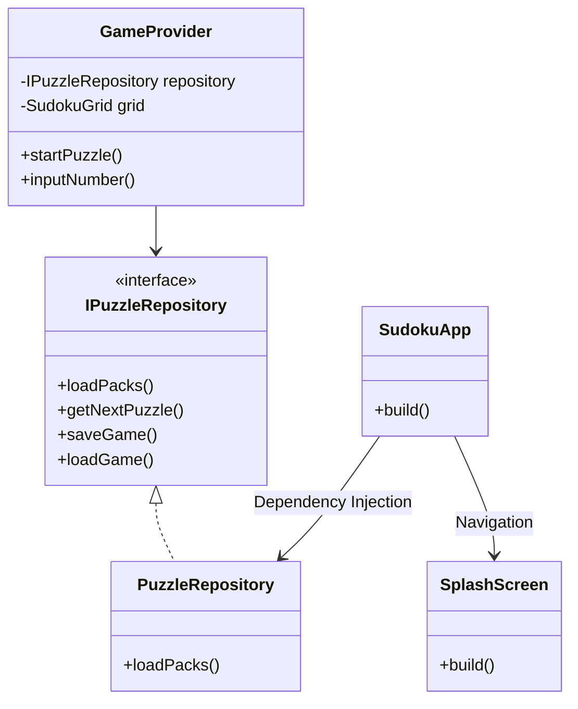

# Architecture Documentation

## Overview
The Sudoku app follows a layered architecture with clear separation of concerns between data, business logic, and UI.

## Directory Structure
- `lib/core`: Shared logic, data models, and repositories.
- `lib/features`: Feature-specific code (e.g., Game, Menu, Settings).
  - Each feature folder typically contains `screens/`, `widgets/`, and `providers/`.

## Architecture Diagram

## Key Decisions
1.  **Repository Pattern**: `IPuzzleRepository` abstracts data access, allowing for easy mocking and testing.
2.  **Provider State Management**: `GameProvider` handles game logic and state, notifying the UI of changes.
3.  **Componentization**: The app is broken down into small, reusable components (e.g., `SudokuCellWidget`, `SplashScreen`).
